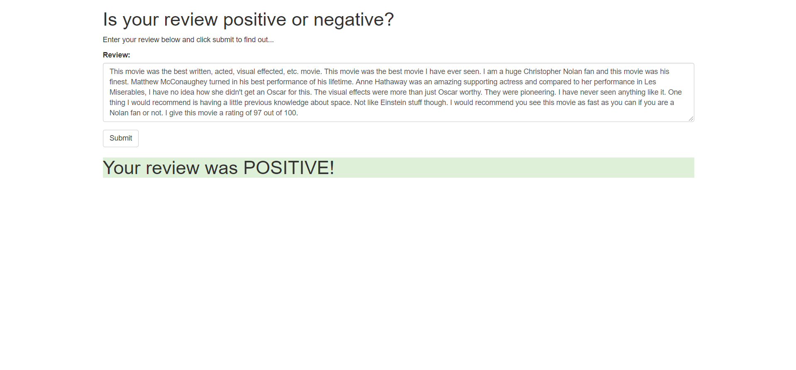

# Deploying a Sentiment Analysis Model

Project 5 of Udacity's DLND: In this project, we construct a recurrent neural network for the purpose of determining the sentiment of a movie review using the IMDB data set. We create this model using Amazon's SageMaker service. In addition, we deploy this model and construct a simple web app which interacts with the deployed model.

### Example:

